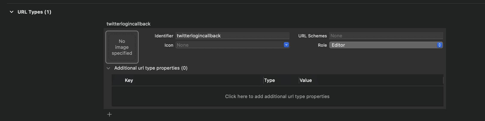

# TwitterLogin
Twitter 的 OAuth 1.0a 驗證流程

* 請填入 consumer key 與 consumer key secret
```swift
enum TwitterInfo {
    static let consumerKey = ""
    static let consumerKeySecret = ""
}
```

* 設定 Callback URL Scheme

